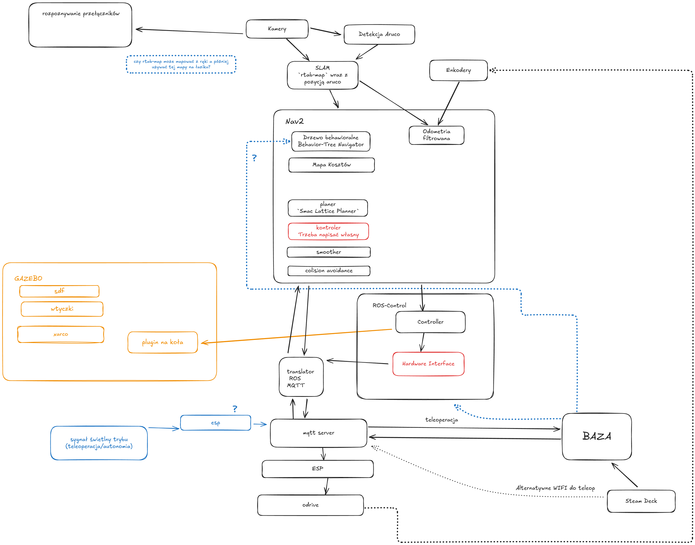

# Opis

This is a repository that hosts the navigation stack for Orion VI Rover. Other software are in diffrent repositories, under the github organization or in individual repositories.

### Software:

The rover will be using a ROS 2 based stack for localization, navigation and control. For SLAM we will be using Realsense cameras with RTAB-Map library. That data will be converted into costmap that is usable by NAV2 for path planning. Custom controller will issue commands over MQTT to execute that path. Gazebo simulator will be used to validate used algorithms. 

Low-level electronics are build on ESP32 that communicates to ODrive via CAN bus and receives MQTT commands through ethernet via Mosquitto server run on Raspberry Pi. Traffic is directed to Jetson Orin NX that hosts the ROS stack, or to remote command center that we will host our laptops running variety of environments. 

Command centre will have one universal app that will have all required operating modes in various tabs. It will have support for joystick or game pad input for direct rover control. It will communicate via direct MQTT or /cmd_vel ROS topic. It will also have rendering of telemetry required for successful operation. 

We are also looking into adding YOLO based object detection for detecting switches and demo mode operated via steam deck, where operator can walk behind the rover without needing whole operation centre. 

### Oprogramowanie:

Łazik będzie używał ROS™ 2 do lokalizacji, nawigacji i kontrolowania napędem. Aby uzyskać SLAM użyjemy biblioteki RTAB-Map z kamerami Realsense™. Uzyskane dane zostaną przekonwertowane w mapę kosztów która będzie użyta do planowania trasy. Napiszemy własny kontroler który będzie wysyłał komendy po MQTT do napędu aby dostać się do celu. Użyjemy symulatora Gazebo do walidacji naszych algorytmów.

# TODO

- [x] launchfile
- [x] Dockerfile
  - [x] Podstawowy Dockerfile
  - [ ] Budowa paczki w Dockerfile (`colcon`)
- [x] Graf/schemat nawigacji
- [ ] Konwersja mapy 3D na mapę kosztów
- [x] Dobry SLAM to podstawa
- [ ] Linter
- [x] Wifi na szufladzie
- [ ] ~~zamienić .e57 na jakiś normalny format~~
- [x] Nav2 i jego pluginy
  - [x] bringup
    - [ ] kontroler
    - [x] TFy
    - [ ] behaviour tree
- [ ] Gazebo
  - [ ] TFy
  - [ ] UDRF i SDF do symulacji 
  - [x] filtry kalmana
  - [ ] Odometria
  - [ ] Kamery
  - [ ] behavior tree / state machine
- [ ] Rozbudowa apki do sterowania 
  - [ ] Podgląd kamer
- [ ] Spisać hasła do różnych rzeczy sieciowych 
- [ ] Otworzyć ssh na rasberce
  - [ ] Sprawdzić kolejkowanie
- [ ] Node który zamienia odczyt z enkoderów na odometrię
- [x] Detekcja arucomarkerów
  - [x] Pre-definiowane kordynaty tych markerów
- [ ] Empiricznie sprawdzić macierze do filtru kalmana
- [ ] trzymadełko na kamerę
- [x] rviz config
- [ ] switch detection in camera (openCV/YOLO)
  - https://github.com/ros-perception/vision_msgs
- [x] aruco/QR auto decode 
- [x] zainstalować system na steam decku
- [x] ogarnąć sieć aby można było sterować steam deckiem poprzez wifi
- [ ] test nvidia jetson
- [ ] fix custom ros-controller
- [x] fix realsense regression
- [x] fix steamdeck input with guID
- [ ] set up foxglove

---

Must have:
 - [ ] odpalenie dockera na jetsonie
 - [ ] napisać własny ros-control
 - [ ] połączyć ros-control w dockera
 - [ ] End to End testing of comms
 - [ ] custom local planer/controler
 - [ ] jak ma się mapowanie do lokalizacji
 - [ ] dostrajanie parametrów
 - [ ] A way to specify the goal cordinates
 
Will make the 10x dev:
 - [ ] gazebo sim
 - [ ] ros bag
 
Good to have:
 - [ ] Documentation to show to people

PRs to make:
 - [ ] RtabMap aruco launch file
 - [ ] RtabMap librealsense regression

Next Year improvements:
  -> DDS on ESP32
  -> nixOS on jetson, NIX Packages and devenv.sh

# Sekcja ROS2

TODO

# Sekcja Docker

patrz [DOCKER.md](./docs/DOCKER.md)

# Sekcja organizacja - skróty itp

Aby stworzyć środowisko developerskie patrz na [DEVELOPMENT.md](./docs/DEVELOPMENT.md)

## ROS2
- nazwa paczki {nazwa}_pkg
- nazwa węzła {nazwa}_node
- nazwa uruchamiacza {nazwa}_launch.py

## Xarco, Gazebo, Symulacja

TODO

# PLAN na ERC

### Przed

 - konwersja mapy .e57 do jakiejś używalnej

### Dzień przed

 ~~- test nawigacji na mapie od organizatorów~~
  rtab-map nie obsługuje importu
    - jeśli nie działa to robimy własną mapę

# Sieć

teleoperacja przez steamdecka
ssid: UBNT
hasło: 123456789

esp szuflada ip: ping 192.168.1.50 

rasberrka ip:  ping 192.168.1.1
użytkownik: `test1`
hasło: `123`

router stół ip: ping 192.168.1.101

router szuflada ip: ping 192.168.1.102

ustawić manualnie ip na laptopie podłączonym do switcha na stole.

# Topiki 

TODO

działają ale nie są dobrze udokumentowane, szukaj w innych repozytoriach
